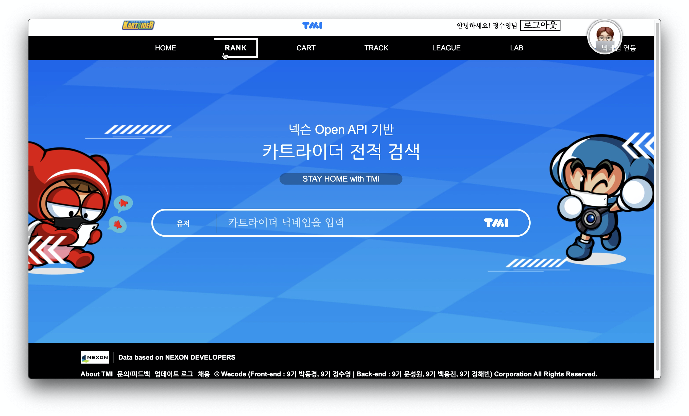

## 5Dragon Project Front-End
- 넥슨(NEXON)의 온라인 레이싱 게임 카트라이더(Kart Rider)의 전적 검색 서비스인 **카트라이더 TMI** 를 클로닝하는 프로젝트
- 프로젝트팀 구성원이 모두 '용'과 관련이 있어서 프로젝트명을 **오룡(5Dragon)** 이라 명명함.
- [카트라이더 TMI 공식 홈페이지 링크](https://tmi.nexon.com/kart)

## 개발 인원 및 기간
- 개발 인원: 프론트엔드 2명, 백엔드 3명
- 개발 기간: 2020/07/06 - 2020/07/17
- [백엔드 github 링크](https://github.com/wecode-bootcamp-korea/9-5dragon-backend)

## 목적
전적 검색 서비스인 만큼 다양한 데이터가 누적되어 있으며, 이를 통해 데이터 시각화를 경험하는 것이 가능할 것으로 생각했다. 또한, 1차 프로젝트와는 달리 함수형 컴포넌트와 Hooks, Styled-components를 사용하고 싶었기 때문에 다양한 시각적 효과와 상태관리를 고루 경험하며 새로운 툴의 숙련도를 높이고자 했다.

## 데모 영상(이미지 클릭)

## 적용 기술
### Front-End
- JavaScript(ES6)
- React.js
- Hooks
- Styled-components
- Sass
- React-router-dom
- Redux
- Redux-thunk
- React-kakao-login
- Chart.js
- React-circular-progressbar
- Fontawesome

### Back-End
- Python
- Django
- Beautifulsoup
- Selenium
- Requests
- Pandas
- Crontab
- Design Pattern : Abstract factory
- Bcrypt
- JWT
- Social Login : KAKAO
- Mysql
- CORS headers
- AWS : EC2, RDS, S3

### 커뮤니케이션 및 버전관리
- Postman
- Slack
- Trello
- Git / Github(git-rebase)

## 구현 기능
- SNS(Kakao) 로그인
- 카트라이더 닉네임 연동
- 데이터 시각화(승률, 리타이어율, 최근 전적 등)
- 화려한 애니메이션

## 미구현 기능
- 구글 로그인
- 카트 페이지(능력치를 보여주는 오각형 범위 그래프)
- 유저 검색 기능